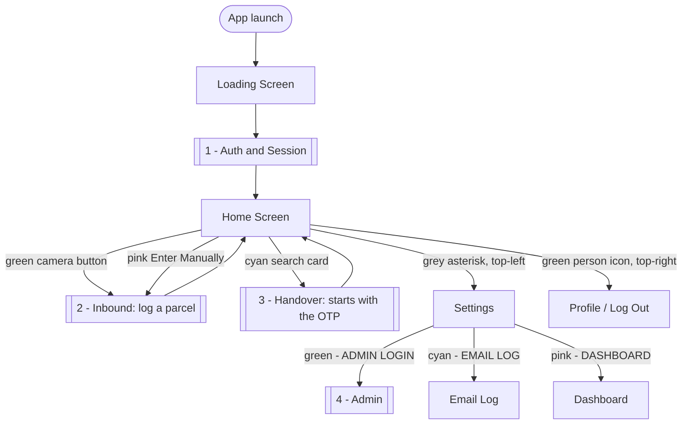
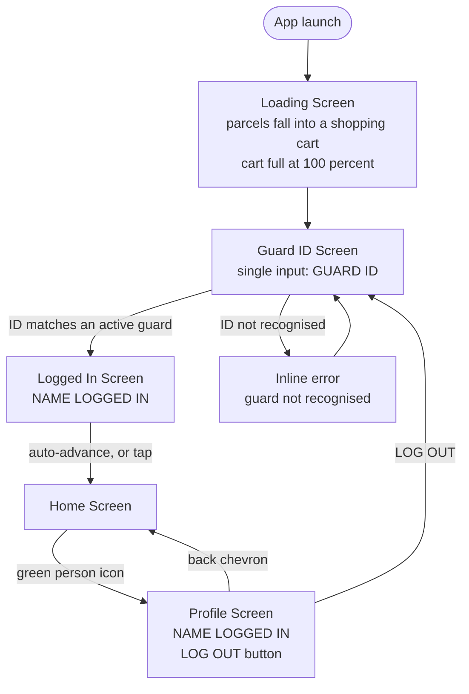
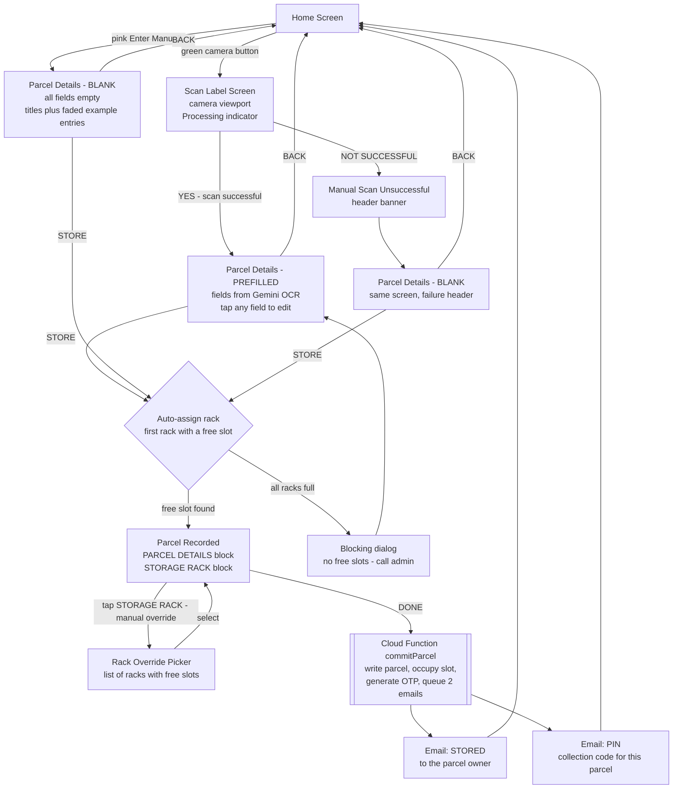
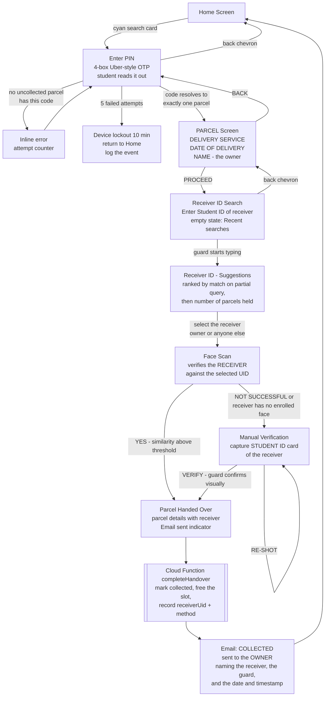
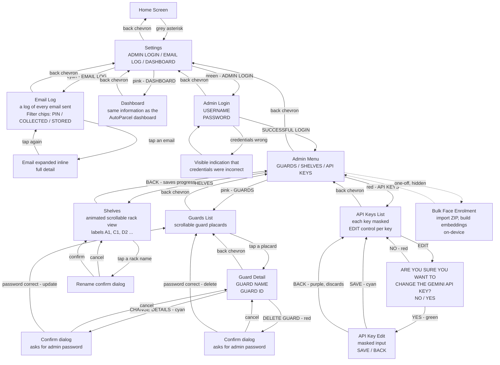

# Parcel App — Flow Diagrams

Transcribed from the hand-drawn UI Framework board. Five diagrams instead of one:
a single graph would be ~70 nodes and both humans and coding agents mis-read it.

Every colour link from the board has been resolved into an explicit navigation edge.
The original colour convention is preserved in the mapping table at the end.

**Revision 2** — handover reordered: the OTP is the first step, and the receiver
is captured separately from the owner.

---

## 0. Top-level map

---

## 1. Auth and session

**Notes**
- Guard sign-in is Guard ID only, exactly as drawn. See `ASSUMPTION A4` in the spec for the recommended hardening.
- The session persists across app restarts until LOG OUT is pressed. A tablet reboot must not silently log a guard out mid-shift.

---

## 2. Inbound — logging a parcel in

**Notes**
- `Manual Scan Unsuccessful` is the same Parcel Details - BLANK screen with a failure header, not a separate screen.
- The rack is only committed on DONE, never on STORE. Pressing back from Parcel Recorded releases the tentative slot.

---

## 3. Handover

**The OTP comes first.** The student arrives and gives the guard the code from
their email. The code identifies exactly one parcel. Only then does the app ask
who is physically collecting it — and that person does **not** have to be the
owner. Anyone may collect; the app records who.

**Notes**
- The COLLECTED email goes to the **owner**, not the receiver. That is the whole
  accountability mechanism: if someone else collects your parcel, you find out.
- The face scan checks the **receiver** against the **receiver's own** enrolled
  face — it confirms "you are who you said you are", not "you are the owner".
- A receiver with no enrolled face routes straight to Manual Verification.

---

## 4. Settings and admin

**Notes**
- **EMAIL LOG is a log of emails sent**, not an email login. Read-only history.
- The API Key Edit screen must **not** autosave. If the device or OS back button
  is pressed, the new key is discarded. This is written explicitly on the board.
- The Shelves screen is the opposite: its BACK **does** save progress.
- Bulk Face Enrolment is not on the board — it is the one-off import path for the
  seed face database. See spec §9.5.

---

## Colour to navigation mapping

The board's colour convention: a coloured element navigates along the arrow of the same colour.
Resolved here so the coding agent never has to interpret colour.

| Colour | Board meaning | Resolved destinations |
|---|---|---|
| Purple | Back / return navigation | Back chevron on every screen; API Key Edit BACK; Guards list return |
| Cyan / blue | Search, edit, save, positive-neutral | Home search card -> Enter PIN; Settings EMAIL LOG -> Email Log; Admin SHELVES -> Shelves; Guard CHANGE DETAILS -> confirm dialog; API Key SAVE; Parcel Recorded DONE |
| Green | Proceed / success / affirm | Home camera -> Scan Label; PARCEL PROCEED; STORE; Scan YES branch; Face Scan YES branch; Manual Verification VERIFY; Admin login SUCCESSFUL LOGIN; Settings ADMIN LOGIN; API key confirm YES |
| Red | Cancel / destructive / failure | BACK on Parcel and Parcel Details; Scan and Face Scan NOT SUCCESSFUL branches; Manual Verification RE-SHOT; DELETE GUARD; Admin API KEYS entry; API key confirm NO |
| Pink / magenta | Secondary entry points | Home Enter Manually -> Parcel Details BLANK; Settings DASHBOARD -> Dashboard; Admin GUARDS -> Guards List; API key EDIT control |
| Grey | Settings | Home asterisk -> Settings |
| Yellow | Annotations, not links | Requirements — all carried into the spec |
